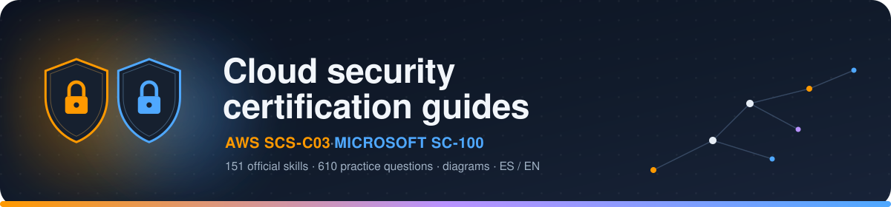

<p align="center">
  
</p>

<p align="center">
  
  
  
  
  
  
</p>

<p align="center">
  <b>🇪🇸 Español</b> &nbsp;·&nbsp; <a href="README.en.md">🇬🇧 English</a>
  &nbsp;&nbsp;|&nbsp;&nbsp;
  <a href="index.html">🌐 Abrir guía (ES)</a> &nbsp;·&nbsp; <a href="en/index.html">🌐 Open guide (EN)</a>
</p>

<p align="center">
  Guía de estudio <b>interactiva</b> para el examen <b>AWS Certified Security — Specialty (SCS-C03)</b>.<br>
  Teoría estructurada, diagramas clicables, comandos CLI/JSON reales, comparativas con Azure y 262 preguntas de práctica. Sin build step: HTML/CSS/JS plano.
</p>

<br>

> **📌 Nota de versión:** el examen SCS-C02 se retiró el 1 dic. 2025. Desde el 2 dic. 2025 el único examen vigente es **SCS-C03** ([exam guide oficial](https://docs.aws.amazon.com/aws-certification/latest/security-specialty-03/security-specialty-03.html)), con dominios reestructurados respecto a SCS-C02. Esta guía sigue la numeración y pesos oficiales de SCS-C03.

## 🚀 Cómo usarla

```bash
git clone https://github.com/ShadowVMX/aws-security-specialist-guide.git
cd aws-security-specialist-guide
```

Abre `index.html` (español) o `en/index.html` (inglés) haciendo doble clic, o sirve la carpeta con cualquier servidor estático simple:

```bash
python3 -m http.server 8000
# → http://localhost:8000
```

## 📚 Dominios (SCS-C03)

| # | Dominio | Peso | Estado |
|---|---|---|---|
| 1 | Detection | 16% | ✅ |
| 2 | Incident Response | 14% | ✅ |
| 3 | Infrastructure Security | 18% | ✅ |
| 4 | Identity and Access Management | 20% | ✅ |
| 5 | Data Protection | 18% | ✅ |
| 6 | Security Foundations & Governance | 14% | ✅ |

Cada módulo incluye: teoría organizada por los *task statements* oficiales del exam guide, 1-2 diagramas SVG interactivos, ejemplos CLI/JSON reales, comparativas con Azure (donde el mapeo es fiable) o ejemplos en lenguaje llano (donde forzar la comparación induciría a error), y un quiz de práctica con explicación en cada respuesta.

## 🗂️ Estructura

```
index.html                 → hub ES con las tarjetas de todos los dominios
en/index.html               → hub EN (mismo contenido, en inglés)
assets/
  css/style.css              → estilos compartidos (tema claro/oscuro automático)
  img/banner.svg              → banner de este README
  js/app.js                   → interacción de diagramas + sidebar activa
  js/quiz.js                  → motor de quiz + progreso guardado (ES/EN según el lang de la página)
modules/<dominio>/
  index.html                → contenido del módulo (español)
  quiz-data.js               → preguntas del quiz (español)
en/modules/<dominio>/
  index.html                → mismo módulo, traducido al inglés
  quiz-data.js               → mismas preguntas, traducidas
```

Cada página en español enlaza a su gemela en `en/` (y viceversa) vía el selector ES/EN de la barra superior.

## 🤝 Cómo contribuir

Este repo acepta contribuciones — con un flujo **estricto** pensado para que cada cambio quede documentado y verificado antes de tocar `main`:

```
 1. Abres un Issue          → plantilla: bug / error de contenido / contenido nuevo
                                (github.com/ShadowVMX/aws-security-specialist-guide/issues/new/choose)
 2. Se discute brevemente   → sobre todo si es contenido nuevo grande (un módulo entero, etc.)
 3. Haces fork + rama       → fix/algo-concreto, content/algo-nuevo...
 4. Cambios + fuente oficial → si tocas contenido técnico, enlaza la doc de AWS/Azure que lo respalda
 5. Abres la PR             → plantilla obligatoria, con "Closes #123"
 6. Review + merge          → main está protegida: PR + 1 review aprobado, sin excepciones
```

**`main` tiene branch protection activada**: no se admite push directo, ni force-push, ni borrar la rama. Toda PR necesita al menos 1 review aprobado antes de poder mergearse.

📋 Plantillas disponibles al abrir un issue: **[🐛 Bug de la web](.github/ISSUE_TEMPLATE/bug.md)** · **[📝 Error de contenido](.github/ISSUE_TEMPLATE/content-error.md)** · **[✨ Contenido nuevo](.github/ISSUE_TEMPLATE/new-content.md)**

📖 Flujo completo, validaciones a correr antes de la PR, y checklist: **[CONTRIBUTING.md](CONTRIBUTING.md)**

<br>

<p align="center">
<sub>Guía de estudio personal — no es material oficial de AWS. Contenido revisado a fecha de 2026.</sub>
</p>
